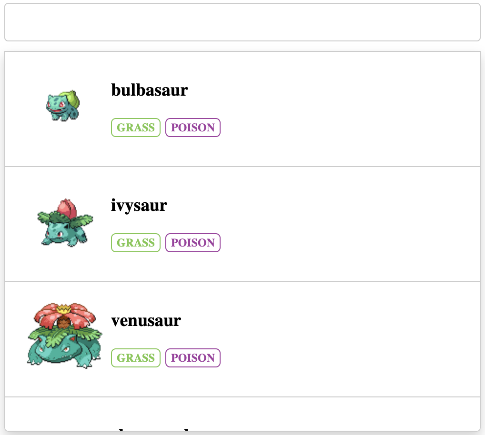
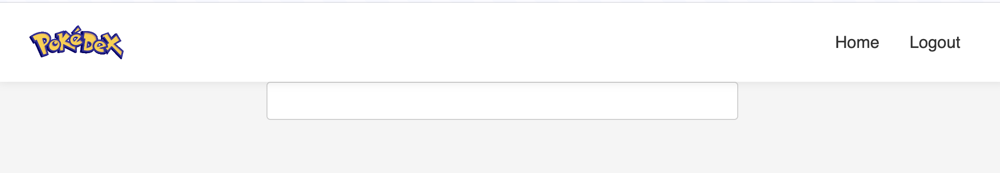

1. Title needs updating
   1. Pokemon detail page title should be the pokemon name
   2. Home page title should be "Pokedex"
   3. Login page title should be "Login"
   4. Sign up page title should be "Sign up"

1. Drop down needs styling
    1. Use the reference image to complete styling on the drop down
    2. 

1. Pokemon detail page needs styling
   1. Use best judgement to style the pokemon detail page to match rest of application

1. Navbar only shows on home page
   1. Navbar should show on all pages

1. Reduce repeated code in templates
   1. Create a base.html that contains the header, and navbar

1. Homepage should display all pokemon

1. Adjust spacing between navbar and page content
   1. 

1. Documentation needs updating
   1. Update the project README.md to include all API routes
   2. Update the project README.md to include all pages and their purpose

1. User profile page
   1. Create a user profile page that displays the user's name and teams

1. Pokemon teams
   1. Create a Team model:
      1. Name (CharField)
      2. Description (TextField) (optional)
      3. User (ForeignKey)
      4. Pokemon (ManyToManyField)
    2. Create a team detail page that displays the team name, description, and pokemon
       1. Users should be able to delete their own teams but not other users' teams
    3. Create a team create page that allows a user to create a team
   
1. Missing pokemon
    1. It appears `Mew` is missing from the database. They should be pokemon 151 but we only have up to 150. Find a way to include Mew so we have all gen 1 pokemon.
